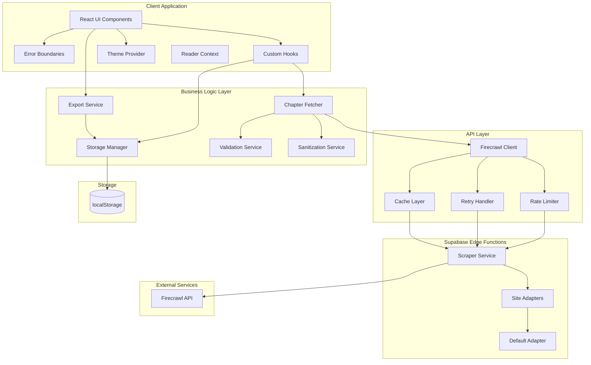
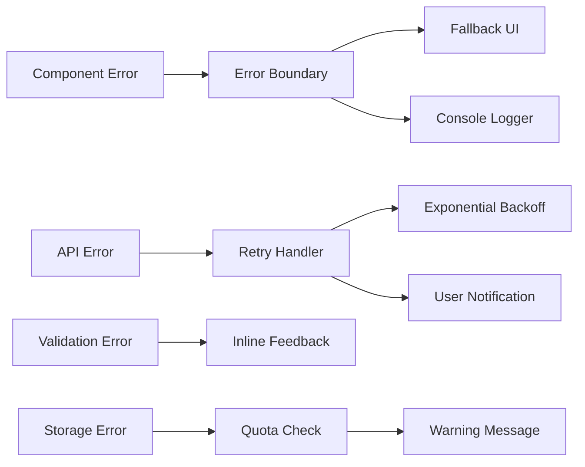
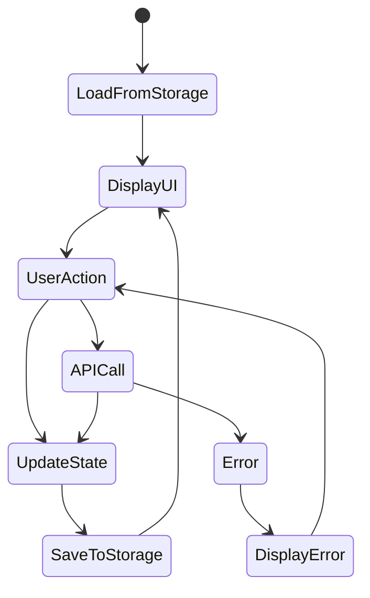

# Design Document: Novel Reader Improvements

## Overview

This design document specifies the technical architecture and implementation approach for improving the Novel Reader web application. The improvements address critical bugs, architectural weaknesses, user experience gaps, and code quality issues across the scraping service, storage layer, UI components, and error handling.

The Novel Reader is a React-based Progressive Web Application (PWA) that enables users to scrape web novels from URLs, read chapters offline with customizable settings, and export content to PDF/DOCX formats. The application uses Supabase Edge Functions to interface with the Firecrawl API for web scraping, localStorage for client-side persistence, and React with TypeScript for the frontend.

### Key Improvements

1. **Reliability**: Error boundaries, retry logic, and comprehensive error handling
2. **Performance**: Rate limiting, batch processing, caching, and storage optimization
3. **Security**: URL validation, content sanitization, and XSS prevention
4. **Extensibility**: Site adapter pattern for multi-site support
5. **User Experience**: Progress tracking, theme customization, reading progress, and search
6. **Code Quality**: Component refactoring, TypeScript strict mode, and comprehensive testing

### Technology Stack

- **Frontend**: React 18, TypeScript, Vite, TailwindCSS, shadcn/ui
- **Backend**: Supabase Edge Functions (Deno runtime)
- **External APIs**: Firecrawl API for web scraping
- **Storage**: localStorage for client-side persistence
- **Testing**: Vitest, React Testing Library, fast-check (property-based testing)
- **Export**: jsPDF for PDF generation, docx for DOCX generation

## Architecture

### High-Level Architecture



### Component Interaction Flow

1. **Novel Scraping Flow**:
   - User enters URL → ValidationService validates → FirecrawlClient checks cache
   - If not cached → RateLimiter enforces limits → ScraperService selects adapter
   - Adapter extracts novel info → SanitizationService cleans content → CacheLayer stores
   - StorageManager persists to localStorage → UI updates

2. **Chapter Fetching Flow**:
   - User requests chapter(s) → ChapterFetcher batches requests → RateLimiter enforces limits
   - RetryHandler wraps requests → ScraperService fetches content → SanitizationService cleans
   - StorageManager persists → UI updates with progress

3. **Reading Flow**:
   - User opens novel → StorageManager loads last read chapter → ReaderContext tracks position
   - User scrolls → Position saved to localStorage → ThemeProvider applies preferences
   - User navigates → Progress tracked → Position restored

4. **Export Flow**:
   - User initiates export → ExportService loads chapters from StorageManager
   - Progress tracked → Content formatted → File generated → Download triggered

### Error Handling Strategy



## Components and Interfaces

### 1. Error Boundary Component

**Purpose**: Catch and handle React component errors gracefully without crashing the entire application.

**Location**: `src/components/ErrorBoundary.tsx`

**Interface**:
```typescript
interface ErrorBoundaryProps {
  children: React.ReactNode;
  fallback?: React.ComponentType<{ error: Error; resetError: () => void }>;
  onError?: (error: Error, errorInfo: React.ErrorInfo) => void;
}

interface ErrorBoundaryState {
  hasError: boolean;
  error: Error | null;
}
```

**Implementation Details**:
- Extends `React.Component` with `componentDidCatch` lifecycle method
- Logs errors to console with stack traces
- Displays fallback UI with error details and reset button
- Allows parent components to continue functioning
- Provides error recovery mechanism

**Usage**:
```typescript
<ErrorBoundary fallback={CustomErrorFallback}>
  <ReaderView />
</ErrorBoundary>
```

### 2. Rate Limiter Utility

**Purpose**: Enforce API rate limits to prevent request throttling and ensure fair usage.

**Location**: `src/lib/utils/rate-limiter.ts`

**Interface**:
```typescript
interface RateLimiterConfig {
  requestsPerSecond: number;
  maxConcurrent: number;
}

class RateLimiter {
  constructor(config: RateLimiterConfig);
  
  async execute<T>(fn: () => Promise<T>): Promise<T>;
  getQueueSize(): number;
  clear(): void;
}
```

**Implementation Details**:
- Token bucket algorithm for rate limiting
- Queue for pending requests
- Configurable via environment variables (default: 2 req/s, 3 concurrent)
- Automatic request scheduling
- Promise-based API

**Algorithm**:
1. Check if tokens available and concurrent limit not exceeded
2. If yes, execute immediately and consume token
3. If no, queue request and wait for token availability
4. Tokens refill at configured rate

### 3. Retry Handler Utility

**Purpose**: Automatically retry failed requests with exponential backoff and intelligent error handling.

**Location**: `src/lib/utils/retry-handler.ts`

**Interface**:
```typescript
interface RetryConfig {
  maxAttempts: number;
  baseDelay: number;
  maxDelay: number;
  shouldRetry: (error: unknown) => boolean;
  onRetry?: (attempt: number, error: unknown) => void;
}

async function withRetry<T>(
  fn: () => Promise<T>,
  config: Partial<RetryConfig>
): Promise<T>;
```

**Implementation Details**:
- Exponential backoff: delay = min(baseDelay * 2^attempt, maxDelay)
- Respects Retry-After header for 429 responses
- Retries on: network errors, 5xx errors, 429 errors
- No retry on: 4xx errors (except 429)
- Logs each retry attempt with timestamp
- Maximum 3 attempts by default

**Retry Decision Logic**:
```typescript
function shouldRetry(error: unknown, attempt: number): boolean {
  if (attempt >= maxAttempts) return false;
  
  if (error instanceof NetworkError) return true;
  if (error instanceof HTTPError) {
    const status = error.status;
    if (status === 429) return true;
    if (status >= 500) return true;
    return false;
  }
  return false;
}
```

### 4. Site Adapter Pattern

**Purpose**: Decouple scraping logic from site-specific structure to support multiple novel sites.

**Location**: `supabase/functions/scrape-novel/adapters/`

**Interface**:
```typescript
interface SiteAdapter {
  name: string;
  urlPattern: RegExp;
  
  extractTitle(markdown: string, metadata: any): string;
  extractDescription(markdown: string, metadata: any): string;
  extractCoverUrl(markdown: string, metadata: any): string | undefined;
  extractChapters(markdown: string, links: string[], baseUrl: string): Chapter[];
}

interface AdapterRegistry {
  register(adapter: SiteAdapter): void;
  getAdapter(url: string): SiteAdapter;
  getDefaultAdapter(): SiteAdapter;
}
```

**Implementation Details**:
- Registry pattern for adapter management
- URL pattern matching for adapter selection
- Default adapter for generic sites
- Site-specific adapters for popular novel sites
- Fallback to default adapter when no match

**Adapter Selection Flow**:
```typescript
function selectAdapter(url: string): SiteAdapter {
  for (const adapter of registeredAdapters) {
    if (adapter.urlPattern.test(url)) {
      return adapter;
    }
  }
  return defaultAdapter;
}
```

**Default Adapter Strategy**:
- Extract title from first H1 heading or metadata
- Extract description from "Summary" section
- Extract cover from first image with "cover" in URL
- Extract chapters using base URL pattern matching
- Fallback to generic extraction when specific patterns fail

### 5. Cache Layer

**Purpose**: Cache Firecrawl API responses to reduce costs and improve performance.

**Location**: `supabase/functions/shared/cache.ts`

**Interface**:
```typescript
interface CacheEntry<T> {
  data: T;
  timestamp: number;
  url: string;
}

interface CacheConfig {
  ttl: number; // milliseconds
  maxSize: number; // number of entries
}

class Cache<T> {
  constructor(config: CacheConfig);
  
  get(key: string): T | null;
  set(key: string, value: T): void;
  has(key: string): boolean;
  clear(): void;
  size(): number;
}
```

**Implementation Details**:
- In-memory LRU cache (Deno KV for production)
- Default TTL: 24 hours
- URL-based keys
- Automatic expiration checking
- LRU eviction when size limit reached
- Separate caches for novel info and chapter content

**Cache Key Strategy**:
```typescript
function getCacheKey(url: string, type: 'novel' | 'chapter'): string {
  const normalized = normalizeUrl(url);
  return `${type}:${normalized}`;
}
```

**Eviction Policy**:
- Track access time for each entry
- When cache full, evict least recently accessed entry
- Update access time on every get operation

### 6. Batch Fetcher

**Purpose**: Fetch multiple chapters efficiently with parallel batching and progress tracking.

**Location**: `src/lib/utils/batch-fetcher.ts`

**Interface**:
```typescript
interface BatchConfig {
  batchSize: number;
  onProgress?: (current: number, total: number, item: any) => void;
  onBatchComplete?: (results: any[]) => void;
  onError?: (error: Error, item: any) => void;
}

class BatchFetcher<T, R> {
  constructor(
    items: T[],
    fetchFn: (item: T) => Promise<R>,
    config: BatchConfig
  );
  
  async execute(): Promise<BatchResult<R>>;
  cancel(): void;
}

interface BatchResult<R> {
  successes: R[];
  failures: Array<{ item: any; error: Error }>;
  cancelled: boolean;
}
```

**Implementation Details**:
- Process items in batches of configurable size (default: 3)
- Batches execute sequentially, items within batch execute in parallel
- Progress callback after each item completes
- Batch complete callback after each batch
- Collect all failures for final reporting
- Cancellation support with cleanup
- Continue processing batch even if individual items fail

**Execution Flow**:
```typescript
async function execute(): Promise<BatchResult> {
  for (let i = 0; i < items.length; i += batchSize) {
    if (cancelled) break;
    
    const batch = items.slice(i, i + batchSize);
    const results = await Promise.allSettled(
      batch.map(item => fetchFn(item))
    );
    
    processResults(results);
    onBatchComplete?.(results);
  }
  
  return { successes, failures, cancelled };
}
```

### 7. Storage Manager

**Purpose**: Manage localStorage persistence with quota monitoring and error handling.

**Location**: `src/lib/storage-manager.ts`

**Interface**:
```typescript
interface StorageQuota {
  used: number;
  available: number;
  percentage: number;
}

interface StorageManager {
  saveNovel(novel: Novel): Promise<void>;
  getNovel(id: string): Novel | null;
  deleteNovel(id: string): Promise<void>;
  getLibrary(): Novel[];
  
  getQuota(): StorageQuota;
  calculateNovelSize(novel: Novel): number;
  checkQuotaWarning(): boolean;
  
  saveReadingProgress(novelId: string, chapterId: string, position: number): void;
  getReadingProgress(novelId: string): ReadingProgress | null;
}

interface ReadingProgress {
  lastChapterId: string;
  scrollPosition: number;
  timestamp: string;
}
```

**Implementation Details**:
- Wrap localStorage operations with error handling
- Calculate storage usage using JSON.stringify byte length
- Estimate available quota (typically 5-10MB)
- Warn at 80% usage threshold
- Provide detailed error messages on quota exceeded
- Separate storage for reading progress
- Atomic operations with rollback on failure

**Quota Calculation**:
```typescript
function getQuota(): StorageQuota {
  let used = 0;
  for (let key in localStorage) {
    used += localStorage[key].length + key.length;
  }
  
  const available = 10 * 1024 * 1024; // 10MB estimate
  const percentage = (used / available) * 100;
  
  return { used, available, percentage };
}
```

### 8. Theme Provider

**Purpose**: Manage theme state and persistence with system preference detection.

**Location**: `src/contexts/ThemeContext.tsx`

**Interface**:
```typescript
type Theme = 'light' | 'dark' | 'system';

interface ThemeContextValue {
  theme: Theme;
  setTheme: (theme: Theme) => void;
  resolvedTheme: 'light' | 'dark';
}

function ThemeProvider({ children }: { children: React.ReactNode }): JSX.Element;
function useTheme(): ThemeContextValue;
```

**Implementation Details**:
- Use next-themes library for theme management
- Persist theme preference to localStorage
- Detect system preference via media query
- Apply theme class to document root
- Support theme toggle with smooth transitions
- Default to system preference on first load

### 9. Reader Customization Context

**Purpose**: Manage reader customization settings (font size, font family) with persistence.

**Location**: `src/contexts/ReaderContext.tsx`

**Interface**:
```typescript
interface ReaderSettings {
  fontSize: number; // 12-24px
  fontFamily: 'serif' | 'sans-serif' | 'monospace';
}

interface ReaderContextValue {
  settings: ReaderSettings;
  updateSettings: (settings: Partial<ReaderSettings>) => void;
  resetSettings: () => void;
}

function ReaderProvider({ children }: { children: React.ReactNode }): JSX.Element;
function useReaderSettings(): ReaderContextValue;
```

**Implementation Details**:
- Persist settings to localStorage
- Apply settings via CSS custom properties
- Validate settings ranges
- Provide default settings
- Immediate application on change

### 10. Custom Hooks

#### useChapterFetcher

**Purpose**: Encapsulate chapter fetching logic with rate limiting and retry.

**Location**: `src/hooks/useChapterFetcher.ts`

**Interface**:
```typescript
interface UseChapterFetcherResult {
  fetchChapter: (chapter: Chapter) => Promise<string>;
  fetchAll: (chapters: Chapter[]) => Promise<void>;
  isLoading: boolean;
  progress: { current: number; total: number };
  cancel: () => void;
}

function useChapterFetcher(novelId: string): UseChapterFetcherResult;
```

#### useChapterNavigation

**Purpose**: Handle chapter navigation logic with keyboard shortcuts.

**Location**: `src/hooks/useChapterNavigation.ts`

**Interface**:
```typescript
interface UseChapterNavigationResult {
  activeChapter: Chapter | null;
  selectChapter: (chapter: Chapter) => void;
  nextChapter: () => void;
  prevChapter: () => void;
  hasNext: boolean;
  hasPrev: boolean;
}

function useChapterNavigation(
  chapters: Chapter[],
  initialChapterId?: string
): UseChapterNavigationResult;
```

#### useReadingProgress

**Purpose**: Track and restore reading progress automatically.

**Location**: `src/hooks/useReadingProgress.ts`

**Interface**:
```typescript
interface UseReadingProgressResult {
  saveProgress: (position: number) => void;
  restoreProgress: () => number;
}

function useReadingProgress(
  novelId: string,
  chapterId: string
): UseReadingProgressResult;
```

#### useChapterSearch

**Purpose**: Filter chapters by title or number with highlighting.

**Location**: `src/hooks/useChapterSearch.ts`

**Interface**:
```typescript
interface UseChapterSearchResult {
  searchQuery: string;
  setSearchQuery: (query: string) => void;
  filteredChapters: Chapter[];
  matchCount: number;
  highlightText: (text: string) => React.ReactNode;
}

function useChapterSearch(chapters: Chapter[]): UseChapterSearchResult;
```

## Data Models

### Novel

```typescript
interface Novel {
  id: string;
  title: string;
  url: string;
  coverUrl?: string;
  description?: string;
  chapters: Chapter[];
  savedAt: string; // ISO 8601
  lastReadChapterId?: string;
  lastReadAt?: string; // ISO 8601
}
```

### Chapter

```typescript
interface Chapter {
  id: string;
  title: string;
  url: string;
  content?: string; // Markdown format
  savedAt?: string; // ISO 8601
  readProgress?: number; // 0-100 percentage
}
```

### API Request/Response Types

```typescript
// Scrape Novel Request
interface ScrapeNovelRequest {
  url: string;
}

// Scrape Novel Response
interface ScrapeNovelResponse {
  success: boolean;
  data?: {
    title: string;
    description: string;
    coverUrl?: string;
    chapters: Array<{
      id: string;
      title: string;
      url: string;
    }>;
  };
  error?: string;
}

// Scrape Chapter Request
interface ScrapeChapterRequest {
  url: string;
}

// Scrape Chapter Response
interface ScrapeChapterResponse {
  success: boolean;
  data?: {
    content: string; // Markdown
  };
  error?: string;
}
```

### Validation Types

```typescript
interface ValidationResult {
  valid: boolean;
  error?: string;
  sanitized?: string;
}

interface URLValidationRules {
  protocols: string[]; // ['http', 'https']
  maxLength: number; // 2048
  requireDomain: boolean;
  blockPatterns: RegExp[]; // Malicious patterns
}
```

### Export Types

```typescript
interface ExportOptions {
  format: 'pdf' | 'docx';
  includeMetadata: boolean;
  includeCover: boolean;
}

interface ExportProgress {
  current: number;
  total: number;
  currentChapter: string;
  status: 'preparing' | 'processing' | 'finalizing' | 'complete';
}
```

## API Designs

### Scraper Service Improvements

**Endpoint**: `supabase/functions/scrape-novel/index.ts`

**Changes**:
1. Fix regex escape bug by replacing corrupted placeholder
2. Implement proper URL escaping for special characters
3. Add site adapter selection logic
4. Integrate cache layer
5. Add content sanitization
6. Improve error responses

**Updated Flow**:
```typescript
async function scrapeNovel(url: string): Promise<NovelInfo> {
  // 1. Validate and sanitize URL
  const validationResult = validateUrl(url);
  if (!validationResult.valid) {
    throw new ValidationError(validationResult.error);
  }
  
  // 2. Check cache
  const cacheKey = getCacheKey(url, 'novel');
  const cached = cache.get(cacheKey);
  if (cached) return cached;
  
  // 3. Select adapter
  const adapter = adapterRegistry.getAdapter(url);
  
  // 4. Fetch from Firecrawl
  const response = await firecrawlClient.scrape(url);
  
  // 5. Extract using adapter
  const novelInfo = adapter.extract(response);
  
  // 6. Sanitize content
  novelInfo.description = sanitizeHtml(novelInfo.description);
  
  // 7. Cache result
  cache.set(cacheKey, novelInfo);
  
  return novelInfo;
}
```

**Endpoint**: `supabase/functions/scrape-chapter/index.ts`

**Changes**:
1. Add cache layer
2. Add content sanitization
3. Improve error handling

**Updated Flow**:
```typescript
async function scrapeChapter(url: string): Promise<string> {
  // 1. Validate URL
  const validationResult = validateUrl(url);
  if (!validationResult.valid) {
    throw new ValidationError(validationResult.error);
  }
  
  // 2. Check cache
  const cacheKey = getCacheKey(url, 'chapter');
  const cached = cache.get(cacheKey);
  if (cached) return cached;
  
  // 3. Fetch from Firecrawl
  const response = await firecrawlClient.scrape(url);
  
  // 4. Extract content
  const content = response.data.markdown;
  
  // 5. Sanitize content
  const sanitized = sanitizeMarkdown(content);
  
  // 6. Cache result
  cache.set(cacheKey, sanitized);
  
  return sanitized;
}
```

### Validation Service API

**Location**: `src/lib/validation.ts`

```typescript
function validateUrl(url: string): ValidationResult {
  // 1. Check protocol
  if (!url.match(/^https?:\/\//)) {
    return { valid: false, error: 'URL must use HTTP or HTTPS protocol' };
  }
  
  // 2. Check length
  if (url.length > 2048) {
    return { valid: false, error: 'URL exceeds maximum length of 2048 characters' };
  }
  
  // 3. Check domain
  try {
    const parsed = new URL(url);
    if (!parsed.hostname) {
      return { valid: false, error: 'URL must contain a valid domain name' };
    }
  } catch {
    return { valid: false, error: 'Invalid URL format' };
  }
  
  // 4. Check malicious patterns
  const maliciousPatterns = [
    /javascript:/i,
    /data:/i,
    /vbscript:/i,
    /<script/i,
  ];
  
  for (const pattern of maliciousPatterns) {
    if (pattern.test(url)) {
      return { valid: false, error: 'URL contains potentially malicious content' };
    }
  }
  
  // 5. Sanitize
  const sanitized = url.trim();
  
  return { valid: true, sanitized };
}
```

### Sanitization Service API

**Location**: `supabase/functions/shared/sanitization.ts`

```typescript
function sanitizeHtml(html: string): string {
  // Remove script tags
  let sanitized = html.replace(/<script\b[^<]*(?:(?!<\/script>)<[^<]*)*<\/script>/gi, '');
  
  // Remove event handlers
  sanitized = sanitized.replace(/\s*on\w+\s*=\s*["'][^"']*["']/gi, '');
  sanitized = sanitized.replace(/\s*on\w+\s*=\s*[^\s>]*/gi, '');
  
  // Remove dangerous iframes
  sanitized = sanitized.replace(/<iframe\b[^<]*(?:(?!<\/iframe>)<[^<]*)*<\/iframe>/gi, '');
  
  // Preserve safe elements: headings, paragraphs, emphasis, lists, links
  // (Already handled by Firecrawl's markdown conversion)
  
  return sanitized;
}

function sanitizeMarkdown(markdown: string): string {
  // Remove HTML script tags that might be embedded
  let sanitized = markdown.replace(/<script\b[^<]*(?:(?!<\/script>)<[^<]*)*<\/script>/gi, '');
  
  // Remove HTML event handlers
  sanitized = sanitized.replace(/\s*on\w+\s*=\s*["'][^"']*["']/gi, '');
  
  // Remove javascript: links
  sanitized = sanitized.replace(/\[([^\]]+)\]\(javascript:[^)]*\)/gi, '[$1](#)');
  
  return sanitized;
}
```

## State Management Approach

### Local State (useState)

Used for:
- Component-specific UI state (loading, errors, modals)
- Form inputs
- Temporary selections

### Context API

Used for:
- Theme preferences (ThemeContext)
- Reader customization settings (ReaderContext)
- Shared across multiple components

### localStorage

Used for:
- Novel library persistence
- Reading progress tracking
- User preferences (theme, font settings)
- Cache data (with expiration)

### State Flow



## Caching Strategy

### Cache Layers

1. **API Response Cache** (Supabase Edge Function)
   - Location: Deno KV or in-memory
   - TTL: 24 hours
   - Keys: URL-based
   - Eviction: LRU

2. **Client Storage Cache** (localStorage)
   - Location: Browser localStorage
   - TTL: Indefinite (user-managed)
   - Keys: Novel ID, Chapter ID
   - Eviction: Manual deletion

### Cache Invalidation

- **Time-based**: Automatic expiration after TTL
- **Manual**: User-triggered refresh
- **Size-based**: LRU eviction when cache full

### Cache Key Strategy

```typescript
// API cache keys
const novelCacheKey = `novel:${normalizeUrl(url)}`;
const chapterCacheKey = `chapter:${normalizeUrl(url)}`;

// localStorage keys
const libraryCacheKey = 'novel-reader-library';
const progressCacheKey = `progress:${novelId}`;
const settingsCacheKey = 'reader-settings';
```


## Correctness Properties

A property is a characteristic or behavior that should hold true across all valid executions of a system—essentially, a formal statement about what the system should do. Properties serve as the bridge between human-readable specifications and machine-verifiable correctness guarantees.

### Property 1: URL Pattern Matching with Special Characters

For any URL containing special regex characters (such as `.`, `*`, `+`, `?`, `[`, `]`, `(`, `)`, `{`, `}`, `|`, `^`, `$`, `\`), when the Scraper_Service creates a regex pattern from that URL, the pattern should be valid (not throw syntax errors) and should correctly match chapter URLs based on that pattern.

**Validates: Requirements 1.2, 1.3, 1.4**

### Property 2: Error Boundary Displays Fallback UI

For any error thrown by a child component wrapped in an error boundary, the error boundary should render the fallback UI containing error information and prevent the error from propagating to parent components.

**Validates: Requirements 2.2, 2.6**

### Property 3: Error Boundary Logs Errors

For any error caught by an error boundary, the error and its component stack should be logged to the console with sufficient detail for debugging.

**Validates: Requirements 2.3**

### Property 4: Rate Limiting Enforces Minimum Delay

For any sequence of requests processed through the rate limiter, the time elapsed between the start of consecutive requests should be at least the configured minimum delay (1/requestsPerSecond).

**Validates: Requirements 3.2, 3.4**

### Property 5: Exponential Backoff Retry Timing

For any request that fails with a retryable error (network error, 5xx, or 429), the retry delays should follow exponential backoff where each subsequent retry delay is approximately double the previous delay (up to the maximum delay), and the total number of retry attempts should not exceed the configured maximum.

**Validates: Requirements 4.1, 4.2**

### Property 6: Retry-After Header Respected

For any request that fails with a 429 status code and includes a Retry-After header, the retry should wait at least the number of seconds specified in the Retry-After header before attempting the next request.

**Validates: Requirements 4.3**

### Property 7: Retry Decision Based on Status Code

For any HTTP error response, the retry handler should retry if and only if the status code is 429, 5xx, or it's a network error; it should not retry for 4xx errors other than 429.

**Validates: Requirements 4.4, 4.5**

### Property 8: Retry Exhaustion Reports Failure

For any request where all retry attempts are exhausted without success, a failure notification should be provided to the user or calling code with details about the final error.

**Validates: Requirements 4.6**

### Property 9: Retry Attempts Are Logged

For any retry attempt, a log entry should be created containing the attempt number, timestamp, and error details.

**Validates: Requirements 4.7**

### Property 10: URL Validation Rejects Invalid URLs

For any URL that doesn't use HTTP/HTTPS protocol, exceeds 2048 characters, lacks a valid domain, or contains malicious patterns, the validation should fail and return a descriptive error message. For any valid URL, validation should pass and return a sanitized version.

**Validates: Requirements 5.1, 5.2, 5.3, 5.5, 5.6**

### Property 11: URL Sanitization Normalization

For any URL with leading/trailing whitespace or protocol variations (http vs https, with/without www), the sanitization should produce a normalized canonical form that is functionally equivalent.

**Validates: Requirements 5.4**

### Property 12: HTML Sanitization Removes Dangerous Elements

For any HTML content containing script tags, event handler attributes (onclick, onerror, etc.), or iframe elements, the sanitized output should not contain any of these dangerous elements while preserving safe formatting elements (headings, paragraphs, emphasis, lists, links).

**Validates: Requirements 6.1, 6.2, 6.3, 6.5**

### Property 13: Markdown Rendering Prevents Script Execution

For any markdown content containing attempted script injection (embedded HTML scripts, javascript: URLs), when rendered by the Reader_Component, no scripts should execute in the browser.

**Validates: Requirements 6.4**

### Property 14: Site Adapter Selection by Domain

For any URL, the Scraper_Service should select the site adapter whose URL pattern matches the domain, or fall back to the default adapter if no specific adapter matches.

**Validates: Requirements 7.4, 7.6**

### Property 15: Cache Hit Prevents API Call

For any request where valid (non-expired) cached content exists, the Scraper_Service should return the cached content without making an API call to Firecrawl.

**Validates: Requirements 8.2, 8.3**

### Property 16: Cache Miss Triggers API Call and Update

For any request where cached content is missing or expired, the Scraper_Service should make an API call to Firecrawl and update the cache with the new content.

**Validates: Requirements 8.4**

### Property 17: LRU Cache Eviction

For any cache at maximum size, when a new entry is added, the least recently used (accessed) entry should be evicted to make space.

**Validates: Requirements 8.7**

### Property 18: Sequential Batch Processing

For any batch fetching operation with multiple batches, each batch should complete (all items in the batch finish, whether success or failure) before the next batch begins processing.

**Validates: Requirements 9.2**

### Property 19: Immediate Next Batch Start

For any batch that completes, the next batch (if one exists) should start immediately without unnecessary delay.

**Validates: Requirements 9.3**

### Property 20: Progress Updates After Each Batch

For any batch that completes, the progress indicator should be updated to reflect the number of items completed so far.

**Validates: Requirements 9.4**

### Property 21: Batch Failure Isolation

For any batch where one or more items fail, all other items in the batch should still be attempted (failures should not stop processing of other items in the same batch).

**Validates: Requirements 9.5**

### Property 22: Batch Failure Collection

For any batch fetching operation, all failures across all batches should be collected and reported together after all batches complete.

**Validates: Requirements 9.6**

### Property 23: Storage Quota Exceeded Error

For any save operation where the data size would cause localStorage to exceed its quota, an error message should be displayed indicating the quota is exceeded and showing available space information.

**Validates: Requirements 10.3**

### Property 24: Storage Quota Warning Suggestion

For any situation where storage quota is exceeded, the error message should include suggestions for freeing space (such as deleting old novels or chapters).

**Validates: Requirements 10.6**

### Property 25: Chapter Search Text Filtering

For any search query text, the filtered chapter list should contain only chapters whose titles contain the search text (case-insensitive), and the count of filtered chapters should match the actual number of chapters in the filtered list.

**Validates: Requirements 11.2, 11.4**

### Property 26: Chapter Search Number Filtering

For any numeric search query, the filtered chapter list should contain only chapters whose chapter numbers match the query.

**Validates: Requirements 11.3**

### Property 27: Chapter Search Highlighting

For any search query that produces matches, the matching text in chapter titles should be highlighted in the UI (wrapped in highlight elements or styled differently).

**Validates: Requirements 11.5**

### Property 28: Search Clear Restores All Chapters

For any chapter list that has been filtered by search, clearing the search query should restore the display of all chapters (the filtered list should equal the original full list).

**Validates: Requirements 11.6**

### Property 29: Scroll Position Persistence

For any chapter, when a user scrolls to a position and then navigates away and returns to that chapter, the scroll position should be restored to the same position (within a reasonable tolerance for rendering differences).

**Validates: Requirements 12.2, 12.3**

### Property 30: Last Read Chapter Restoration

For any novel, when a user opens the novel, the chapter that was last read (most recently viewed) should be automatically selected and displayed.

**Validates: Requirements 12.5**

### Property 31: Theme Toggle Switches Theme

For any theme state (light or dark), clicking the theme toggle should switch to the opposite theme state.

**Validates: Requirements 13.2**

### Property 32: Theme Preference Persistence

For any theme preference set by the user, after saving and reloading the application, the same theme preference should be applied.

**Validates: Requirements 13.3, 13.4**

### Property 33: Font Settings Application and Persistence

For any font size or font family setting changed by the user, the changes should be immediately visible in the reader content, and after reloading the application, the same settings should be applied.

**Validates: Requirements 14.3, 14.4, 14.5**

### Property 34: Font Settings Reset

For any customized font settings, clicking the reset button should restore the default font size and font family values.

**Validates: Requirements 14.6**

### Property 35: Export Progress Accuracy

For any export operation (PDF or DOCX), the progress indicator should accurately reflect the current chapter being processed, the number of chapters processed so far, and the total number of chapters, with the percentage calculated correctly.

**Validates: Requirements 15.2, 15.3, 15.4**

### Property 36: Export Completion Notification

For any export operation that completes successfully, a completion message should be displayed to the user.

**Validates: Requirements 15.5**

### Property 37: Export Cancellation

For any export operation in progress, if the user cancels, the export should stop processing and no file should be downloaded.

**Validates: Requirements 15.6**

### Property 38: Fetch All Progress Accuracy

For any "Fetch All" operation, the progress bar should accurately show the number of chapters fetched, total chapters, percentage completion, and the title of the chapter currently being fetched.

**Validates: Requirements 16.2, 16.3, 16.4**

### Property 39: Fetch All Cancellation Preserves Fetched Chapters

For any "Fetch All" operation that is cancelled mid-process, all chapters that were successfully fetched before cancellation should be saved to storage.

**Validates: Requirements 16.5, 16.6**

### Property 40: Network Error Suggests Connection Check

For any error that is identified as a network error, the error message displayed to the user should include a suggestion to check their internet connection.

**Validates: Requirements 19.2**

### Property 41: API Error Message Passthrough

For any error response from an API that includes an error message, the displayed error message should include the specific error message from the API response.

**Validates: Requirements 19.3**

### Property 42: Validation Error Feedback

For any validation error on user input, the invalid input field should be highlighted and an explanation of the validation requirement should be displayed.

**Validates: Requirements 19.4**

### Property 43: Error Logging Detail

For any error that occurs in the application, detailed error information (including error message, stack trace, and context) should be logged to the console.

**Validates: Requirements 19.5**


## Error Handling

### Error Categories

1. **Component Errors** (React rendering errors)
   - Caught by: Error Boundaries
   - Response: Display fallback UI, log to console, allow app to continue
   - User Action: Retry button, navigate away

2. **Network Errors** (fetch failures, timeouts)
   - Caught by: Retry Handler
   - Response: Automatic retry with exponential backoff (up to 3 attempts)
   - User Action: Wait for retry, cancel operation

3. **API Errors** (Firecrawl API failures)
   - 4xx errors: Display error message, no retry (except 429)
   - 429 errors: Retry after delay specified in Retry-After header
   - 5xx errors: Retry with exponential backoff
   - User Action: Check input, try different URL, wait and retry

4. **Validation Errors** (invalid user input)
   - Caught by: Validation Service
   - Response: Inline error message, highlight invalid field
   - User Action: Correct input based on feedback

5. **Storage Errors** (localStorage quota exceeded)
   - Caught by: Storage Manager
   - Response: Error message with quota info and suggestions
   - User Action: Delete old novels/chapters, export and clear

6. **Sanitization Errors** (malicious content detected)
   - Caught by: Sanitization Service
   - Response: Content cleaned or rejected, warning logged
   - User Action: None (automatic handling)

### Error Message Guidelines

**User-Facing Messages**:
- Use plain language, avoid technical jargon
- Explain what went wrong in user terms
- Provide actionable next steps
- Include relevant context (URL, chapter title, etc.)

**Examples**:
```typescript
// Good
"Unable to fetch chapter. Please check your internet connection and try again."

// Bad
"Network request failed with ERR_CONNECTION_REFUSED"

// Good
"This URL is too long (2,150 characters). URLs must be under 2,048 characters."

// Bad
"URL validation failed: length > MAX_URL_LENGTH"

// Good
"Storage is full (9.8 MB used of 10 MB). Delete some novels to free up space."

// Bad
"QuotaExceededError: DOM Exception 22"
```

**Developer Logs**:
- Include full error details (message, stack trace, error code)
- Add context (function name, parameters, state)
- Use structured logging for easier debugging
- Include timestamps

**Example**:
```typescript
console.error('[ChapterFetcher] Failed to fetch chapter', {
  chapterId: chapter.id,
  chapterUrl: chapter.url,
  novelId: novel.id,
  attempt: attemptNumber,
  error: error.message,
  stack: error.stack,
  timestamp: new Date().toISOString(),
});
```

### Error Recovery Strategies

1. **Automatic Retry**: Network errors, 5xx errors, 429 errors
2. **User Retry**: Component errors (via reset button), failed operations (via retry button)
3. **Graceful Degradation**: Show cached content when API unavailable
4. **Partial Success**: Save successfully fetched chapters even if some fail
5. **Fallback UI**: Error boundaries prevent full app crash
6. **Data Preservation**: Never lose user data on errors (atomic operations)

### Error Boundary Placement

```
App
├── ErrorBoundary (top-level)
│   ├── Router
│   │   ├── Index Page
│   │   └── Reader Page
│   │       ├── ErrorBoundary (reader-level)
│   │       │   └── ReaderView
│   │       └── ErrorBoundary (chapter-list-level)
│   │           └── ChapterList
```

### Error State Management

```typescript
interface ErrorState {
  hasError: boolean;
  error: Error | null;
  errorInfo: React.ErrorInfo | null;
  recoverable: boolean;
}

// Component-level error state
const [error, setError] = useState<string | null>(null);
const [isRetrying, setIsRetrying] = useState(false);

// Error boundary state
class ErrorBoundary extends React.Component<Props, ErrorState> {
  state = {
    hasError: false,
    error: null,
    errorInfo: null,
    recoverable: true,
  };
  
  static getDerivedStateFromError(error: Error): Partial<ErrorState> {
    return { hasError: true, error };
  }
  
  componentDidCatch(error: Error, errorInfo: React.ErrorInfo) {
    this.setState({ errorInfo });
    console.error('Error boundary caught:', error, errorInfo);
    this.props.onError?.(error, errorInfo);
  }
  
  resetError = () => {
    this.setState({
      hasError: false,
      error: null,
      errorInfo: null,
    });
  };
  
  render() {
    if (this.state.hasError) {
      return this.props.fallback ? (
        <this.props.fallback 
          error={this.state.error!} 
          resetError={this.resetError} 
        />
      ) : (
        <DefaultErrorFallback 
          error={this.state.error!} 
          resetError={this.resetError} 
        />
      );
    }
    
    return this.props.children;
  }
}
```

## Testing Strategy

### Testing Approach

The Novel Reader improvements will use a dual testing approach combining traditional unit/integration tests with property-based testing to ensure comprehensive coverage and correctness.

**Unit Tests**: Verify specific examples, edge cases, and error conditions
**Property Tests**: Verify universal properties across all inputs

Together, these approaches provide comprehensive coverage where unit tests catch concrete bugs and property tests verify general correctness across a wide range of inputs.

### Property-Based Testing

**Library**: fast-check (JavaScript/TypeScript property-based testing library)

**Configuration**:
- Minimum 100 iterations per property test (due to randomization)
- Each property test must reference its design document property
- Tag format: `Feature: novel-reader-improvements, Property {number}: {property_text}`

**Example Property Test**:
```typescript
import fc from 'fast-check';
import { describe, it, expect } from 'vitest';
import { validateUrl } from '@/lib/validation';

describe('URL Validation', () => {
  it('Property 10: URL Validation Rejects Invalid URLs', () => {
    // Feature: novel-reader-improvements, Property 10
    fc.assert(
      fc.property(
        fc.oneof(
          // Invalid protocols
          fc.record({
            protocol: fc.constantFrom('ftp://', 'file://', 'javascript:'),
            domain: fc.domain(),
            path: fc.string(),
          }).map(({ protocol, domain, path }) => `${protocol}${domain}${path}`),
          
          // URLs exceeding max length
          fc.string({ minLength: 2049 }),
          
          // Missing domain
          fc.constantFrom('http://', 'https://'),
          
          // Malicious patterns
          fc.constantFrom(
            'http://example.com/<script>alert(1)</script>',
            'javascript:alert(1)',
            'data:text/html,<script>alert(1)</script>'
          )
        ),
        (invalidUrl) => {
          const result = validateUrl(invalidUrl);
          expect(result.valid).toBe(false);
          expect(result.error).toBeDefined();
        }
      ),
      { numRuns: 100 }
    );
  });
  
  it('Property 10: URL Validation Accepts Valid URLs', () => {
    // Feature: novel-reader-improvements, Property 10
    fc.assert(
      fc.property(
        fc.webUrl({ validSchemes: ['http', 'https'] }),
        (validUrl) => {
          // Ensure URL is under max length
          if (validUrl.length > 2048) return;
          
          const result = validateUrl(validUrl);
          expect(result.valid).toBe(true);
          expect(result.sanitized).toBeDefined();
        }
      ),
      { numRuns: 100 }
    );
  });
});
```

### Unit Testing Strategy

**Test Coverage Targets**:
- Storage Manager: 80% code coverage
- Scraper Service: 80% code coverage
- URL Validation: 100% code coverage
- Content Sanitization: 100% code coverage
- Rate Limiter: 80% code coverage
- Retry Handler: 80% code coverage

**Test Organization**:
```
src/
├── lib/
│   ├── validation.ts
│   ├── validation.test.ts
│   ├── storage-manager.ts
│   ├── storage-manager.test.ts
│   └── utils/
│       ├── rate-limiter.ts
│       ├── rate-limiter.test.ts
│       ├── retry-handler.ts
│       └── retry-handler.test.ts
├── components/
│   ├── ErrorBoundary.tsx
│   ├── ErrorBoundary.test.tsx
│   ├── ReaderView.tsx
│   └── ReaderView.test.tsx
└── hooks/
    ├── useChapterFetcher.ts
    └── useChapterFetcher.test.ts

supabase/functions/
├── scrape-novel/
│   ├── index.ts
│   ├── index.test.ts
│   └── adapters/
│       ├── default-adapter.ts
│       └── default-adapter.test.ts
└── shared/
    ├── sanitization.ts
    ├── sanitization.test.ts
    ├── cache.ts
    └── cache.test.ts
```

**Example Unit Tests**:

```typescript
// Storage Manager Tests
describe('StorageManager', () => {
  beforeEach(() => {
    localStorage.clear();
  });
  
  it('should save and retrieve novel', () => {
    const novel: Novel = {
      id: 'test-1',
      title: 'Test Novel',
      url: 'https://example.com/novel',
      chapters: [],
      savedAt: new Date().toISOString(),
    };
    
    storageManager.saveNovel(novel);
    const retrieved = storageManager.getNovel('test-1');
    
    expect(retrieved).toEqual(novel);
  });
  
  it('should calculate storage quota correctly', () => {
    const quota = storageManager.getQuota();
    
    expect(quota.used).toBeGreaterThanOrEqual(0);
    expect(quota.available).toBeGreaterThan(0);
    expect(quota.percentage).toBeGreaterThanOrEqual(0);
    expect(quota.percentage).toBeLessThanOrEqual(100);
  });
  
  it('should throw error when quota exceeded', () => {
    // Create a large novel that exceeds quota
    const largeNovel: Novel = {
      id: 'large-1',
      title: 'Large Novel',
      url: 'https://example.com/large',
      chapters: Array(1000).fill(null).map((_, i) => ({
        id: `ch-${i}`,
        title: `Chapter ${i}`,
        url: `https://example.com/large/${i}`,
        content: 'x'.repeat(10000), // 10KB per chapter
      })),
      savedAt: new Date().toISOString(),
    };
    
    expect(() => storageManager.saveNovel(largeNovel)).toThrow(/quota/i);
  });
});

// Rate Limiter Tests
describe('RateLimiter', () => {
  it('should enforce minimum delay between requests', async () => {
    const limiter = new RateLimiter({ requestsPerSecond: 2, maxConcurrent: 3 });
    const timestamps: number[] = [];
    
    const requests = Array(5).fill(null).map(() =>
      limiter.execute(async () => {
        timestamps.push(Date.now());
        return 'done';
      })
    );
    
    await Promise.all(requests);
    
    // Check that consecutive requests have at least 500ms delay (2 req/s)
    for (let i = 1; i < timestamps.length; i++) {
      const delay = timestamps[i] - timestamps[i - 1];
      expect(delay).toBeGreaterThanOrEqual(450); // Allow 50ms tolerance
    }
  });
  
  it('should respect concurrent request limit', async () => {
    const limiter = new RateLimiter({ requestsPerSecond: 10, maxConcurrent: 2 });
    let concurrent = 0;
    let maxConcurrent = 0;
    
    const requests = Array(5).fill(null).map(() =>
      limiter.execute(async () => {
        concurrent++;
        maxConcurrent = Math.max(maxConcurrent, concurrent);
        await new Promise(resolve => setTimeout(resolve, 100));
        concurrent--;
      })
    );
    
    await Promise.all(requests);
    
    expect(maxConcurrent).toBeLessThanOrEqual(2);
  });
});

// Retry Handler Tests
describe('RetryHandler', () => {
  it('should retry on network errors with exponential backoff', async () => {
    let attempts = 0;
    const delays: number[] = [];
    let lastTime = Date.now();
    
    const fn = async () => {
      attempts++;
      const now = Date.now();
      if (attempts > 1) {
        delays.push(now - lastTime);
      }
      lastTime = now;
      
      if (attempts < 3) {
        throw new Error('Network error');
      }
      return 'success';
    };
    
    const result = await withRetry(fn, {
      maxAttempts: 3,
      baseDelay: 100,
      maxDelay: 1000,
    });
    
    expect(result).toBe('success');
    expect(attempts).toBe(3);
    expect(delays[0]).toBeGreaterThanOrEqual(90); // ~100ms
    expect(delays[1]).toBeGreaterThanOrEqual(180); // ~200ms
  });
  
  it('should not retry on 4xx errors except 429', async () => {
    let attempts = 0;
    
    const fn = async () => {
      attempts++;
      const error = new Error('Not found') as any;
      error.status = 404;
      throw error;
    };
    
    await expect(withRetry(fn, { maxAttempts: 3 })).rejects.toThrow('Not found');
    expect(attempts).toBe(1); // No retries
  });
});

// Sanitization Tests
describe('Sanitization', () => {
  it('should remove script tags', () => {
    const html = '<p>Hello</p><script>alert(1)</script><p>World</p>';
    const sanitized = sanitizeHtml(html);
    
    expect(sanitized).not.toContain('<script');
    expect(sanitized).toContain('<p>Hello</p>');
    expect(sanitized).toContain('<p>World</p>');
  });
  
  it('should remove event handlers', () => {
    const html = '<div onclick="alert(1)">Click me</div>';
    const sanitized = sanitizeHtml(html);
    
    expect(sanitized).not.toContain('onclick');
    expect(sanitized).toContain('Click me');
  });
  
  it('should remove iframes', () => {
    const html = '<p>Content</p><iframe src="evil.com"></iframe>';
    const sanitized = sanitizeHtml(html);
    
    expect(sanitized).not.toContain('<iframe');
    expect(sanitized).toContain('<p>Content</p>');
  });
  
  it('should preserve safe elements', () => {
    const html = '<h1>Title</h1><p>Paragraph</p><em>Emphasis</em><strong>Bold</strong>';
    const sanitized = sanitizeHtml(html);
    
    expect(sanitized).toContain('<h1>Title</h1>');
    expect(sanitized).toContain('<p>Paragraph</p>');
    expect(sanitized).toContain('<em>Emphasis</em>');
    expect(sanitized).toContain('<strong>Bold</strong>');
  });
});
```

### Integration Testing

**Test Scenarios**:

1. **Chapter Fetching Workflow**:
   - User adds novel → Scraper fetches info → Chapters displayed
   - User clicks "Fetch All" → Batch fetcher processes → Progress updates → Chapters saved
   - Network error occurs → Retry handler retries → Success or failure reported

2. **Export Workflow**:
   - User selects export format → Export service loads chapters → Progress updates
   - Content formatted → File generated → Download triggered

3. **Reading Progress Workflow**:
   - User opens novel → Last read chapter loaded → Scroll position restored
   - User scrolls → Position saved → User navigates away → Returns → Position restored

4. **Theme and Customization Workflow**:
   - User changes theme → Theme applied → Preference saved
   - User changes font settings → Settings applied → Preference saved
   - User reloads app → Preferences restored

**Example Integration Test**:
```typescript
describe('Chapter Fetching Integration', () => {
  it('should fetch all chapters with progress tracking', async () => {
    const novel: Novel = {
      id: 'test-1',
      title: 'Test Novel',
      url: 'https://example.com/novel',
      chapters: [
        { id: 'ch-1', title: 'Chapter 1', url: 'https://example.com/novel/1' },
        { id: 'ch-2', title: 'Chapter 2', url: 'https://example.com/novel/2' },
        { id: 'ch-3', title: 'Chapter 3', url: 'https://example.com/novel/3' },
      ],
      savedAt: new Date().toISOString(),
    };
    
    const progressUpdates: Array<{ current: number; total: number }> = [];
    
    const { result } = renderHook(() => useChapterFetcher(novel.id));
    
    act(() => {
      result.current.fetchAll(novel.chapters, (current, total) => {
        progressUpdates.push({ current, total });
      });
    });
    
    await waitFor(() => {
      expect(result.current.isLoading).toBe(false);
    });
    
    // Verify progress updates
    expect(progressUpdates.length).toBeGreaterThan(0);
    expect(progressUpdates[progressUpdates.length - 1]).toEqual({
      current: 3,
      total: 3,
    });
    
    // Verify chapters saved
    const savedNovel = storageManager.getNovel(novel.id);
    expect(savedNovel?.chapters.every(ch => ch.content)).toBe(true);
  });
});
```

### Continuous Integration

**CI Configuration** (GitHub Actions):
```yaml
name: Test

on: [push, pull_request]

jobs:
  test:
    runs-on: ubuntu-latest
    
    steps:
      - uses: actions/checkout@v3
      
      - name: Setup Node.js
        uses: actions/setup-node@v3
        with:
          node-version: '18'
      
      - name: Install dependencies
        run: npm ci
      
      - name: Run linter
        run: npm run lint
      
      - name: Run type check
        run: npx tsc --noEmit
      
      - name: Run unit tests
        run: npm test
      
      - name: Run integration tests
        run: npm run test:integration
      
      - name: Generate coverage report
        run: npm run test:coverage
      
      - name: Upload coverage to Codecov
        uses: codecov/codecov-action@v3
```

### Test Data Generators

For property-based testing, we'll create custom generators:

```typescript
// Custom generators for fast-check
import fc from 'fast-check';

// Generate valid novel URLs
export const novelUrlArbitrary = fc.webUrl({
  validSchemes: ['http', 'https'],
  size: 'small',
}).filter(url => url.length <= 2048);

// Generate chapters
export const chapterArbitrary = fc.record({
  id: fc.uuid(),
  title: fc.string({ minLength: 1, maxLength: 100 }),
  url: novelUrlArbitrary,
  content: fc.option(fc.lorem({ maxCount: 1000 }), { nil: undefined }),
});

// Generate novels
export const novelArbitrary = fc.record({
  id: fc.uuid(),
  title: fc.string({ minLength: 1, maxLength: 200 }),
  url: novelUrlArbitrary,
  coverUrl: fc.option(fc.webUrl(), { nil: undefined }),
  description: fc.option(fc.lorem({ maxCount: 500 }), { nil: undefined }),
  chapters: fc.array(chapterArbitrary, { minLength: 1, maxLength: 50 }),
  savedAt: fc.date().map(d => d.toISOString()),
});

// Generate HTML with potential XSS
export const maliciousHtmlArbitrary = fc.oneof(
  fc.constant('<script>alert(1)</script>'),
  fc.constant(''),
  fc.constant('<iframe src="javascript:alert(1)"></iframe>'),
  fc.constant('<div onclick="alert(1)">Click</div>'),
  fc.string().map(s => `<p>${s}</p><script>${s}</script>`),
);

// Generate URLs with special regex characters
export const urlWithSpecialCharsArbitrary = fc.tuple(
  fc.domain(),
  fc.constantFrom('.', '*', '+', '?', '[', ']', '(', ')', '{', '}', '|', '^', '$', '\\'),
  fc.string({ minLength: 1, maxLength: 20 }),
).map(([domain, specialChar, path]) => 
  `https://${domain}/${specialChar}${path}`
);
```

### Testing Best Practices

1. **Isolation**: Each test should be independent and not rely on other tests
2. **Cleanup**: Clear localStorage and reset mocks between tests
3. **Determinism**: Use fixed seeds for random data in unit tests
4. **Fast Execution**: Keep unit tests fast (<100ms each), use mocks for external dependencies
5. **Clear Assertions**: Use descriptive assertion messages
6. **Edge Cases**: Explicitly test boundary conditions (empty arrays, null values, max lengths)
7. **Error Cases**: Test error paths as thoroughly as success paths
8. **Property Tests**: Use property-based tests for algorithms and data transformations
9. **Integration Tests**: Test critical user workflows end-to-end
10. **Coverage**: Aim for high coverage but prioritize meaningful tests over coverage percentage

### Manual Testing Checklist

Before release, manually verify:

- [ ] Novel scraping works for multiple sites
- [ ] "Fetch All" completes successfully with progress updates
- [ ] Export to PDF and DOCX produces valid files
- [ ] Theme toggle works and persists
- [ ] Font customization applies and persists
- [ ] Reading progress saves and restores correctly
- [ ] Search filters chapters correctly
- [ ] Error boundaries catch and display errors
- [ ] Storage quota warnings appear at 80%
- [ ] Rate limiting prevents API throttling
- [ ] Retry logic handles network failures
- [ ] Content sanitization removes XSS attempts
- [ ] Mobile responsive design works correctly
- [ ] Keyboard navigation works (arrow keys, shortcuts)
- [ ] Accessibility: screen reader compatibility

---

## Implementation Notes

### Component Refactoring Plan

The current `Reader.tsx` component (150+ lines) should be split into:

1. **ReaderPage.tsx** (orchestrator)
   - Manages overall page state
   - Coordinates between child components
   - Handles routing

2. **ReaderToolbar.tsx** (already exists as NovelToolbar)
   - Export buttons
   - Fetch All button
   - Back navigation

3. **ChapterList.tsx** (already exists)
   - Chapter display
   - Search functionality
   - Selection handling

4. **ReaderContent.tsx** (refactored from ReaderView)
   - Chapter content display
   - Navigation controls
   - Reading progress tracking

5. **Custom Hooks**:
   - `useChapterFetcher` - Fetch logic
   - `useChapterNavigation` - Navigation logic
   - `useReadingProgress` - Progress tracking
   - `useChapterSearch` - Search/filter logic

### TypeScript Strict Mode Migration

Steps to enable strict mode:

1. Enable `strict: true` in `tsconfig.json`
2. Fix type errors file by file:
   - Add explicit return types to functions
   - Replace `any` with proper types
   - Handle null/undefined explicitly
   - Add type guards where needed
3. Run `tsc --noEmit` to verify no errors
4. Update tests to match new types

### Performance Considerations

1. **Virtualization**: Use react-window for long chapter lists (>100 chapters)
2. **Debouncing**: Debounce search input (300ms delay)
3. **Memoization**: Memoize expensive computations (chapter filtering, sanitization)
4. **Lazy Loading**: Code-split export functionality
5. **Web Workers**: Consider moving sanitization to web worker for large content
6. **IndexedDB**: Consider migrating from localStorage to IndexedDB for larger storage

### Security Considerations

1. **Content Security Policy**: Add CSP headers to prevent XSS
2. **Input Validation**: Validate all user inputs before processing
3. **Output Encoding**: Encode all user-generated content before display
4. **Dependency Auditing**: Regularly audit npm dependencies for vulnerabilities
5. **API Key Protection**: Never expose Firecrawl API key in client code
6. **HTTPS Only**: Enforce HTTPS for all external requests

### Accessibility Requirements

1. **Keyboard Navigation**: All functionality accessible via keyboard
2. **Screen Reader Support**: Proper ARIA labels and roles
3. **Focus Management**: Logical focus order, visible focus indicators
4. **Color Contrast**: WCAG AA compliance for all text
5. **Responsive Text**: Support browser zoom up to 200%
6. **Alternative Text**: Descriptive alt text for images

---

This design document provides a comprehensive blueprint for implementing the Novel Reader improvements. Each component, interface, and strategy has been carefully designed to address the requirements while maintaining code quality, security, and user experience.

